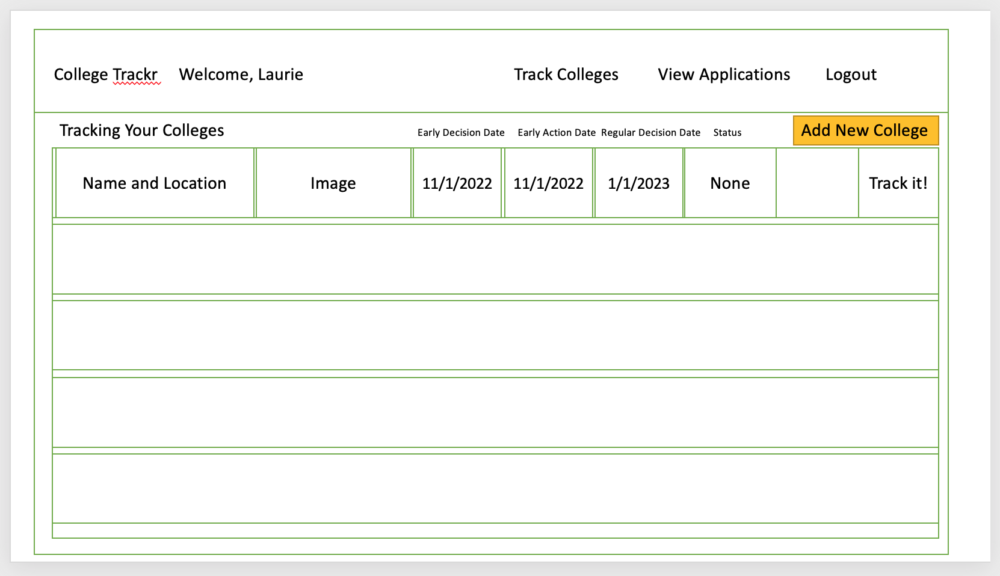
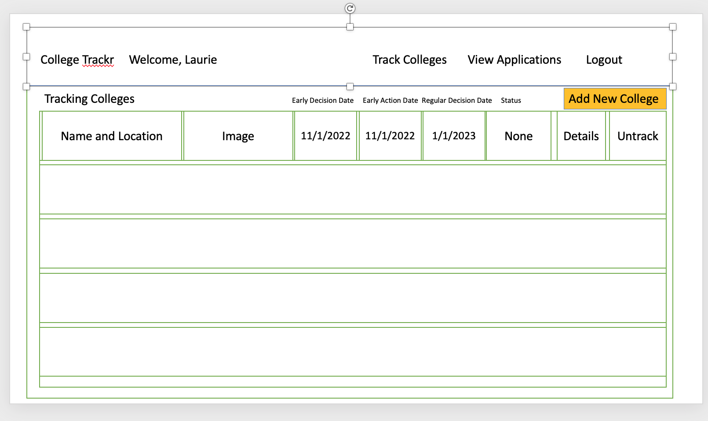
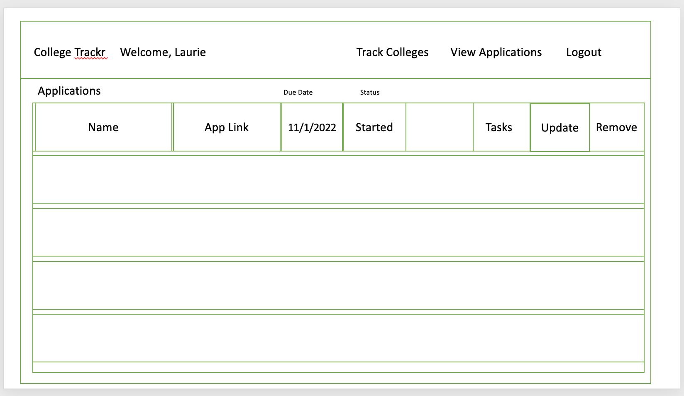
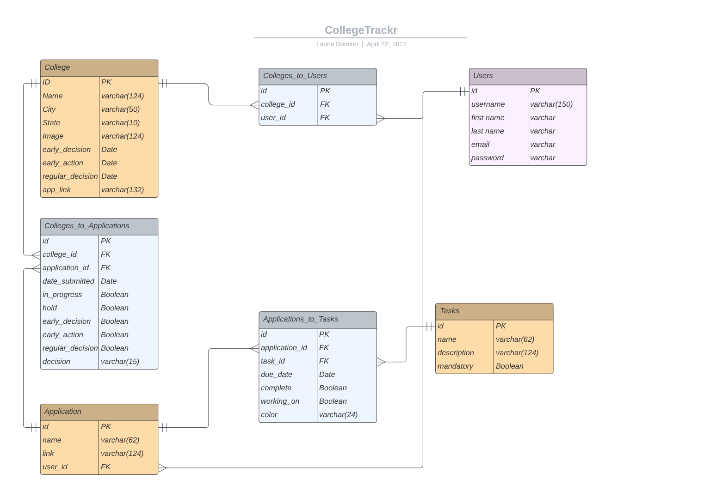

College Trackr

# Description
College Trackr is an app designed to allow parents and students to track their college admissions process.
Parents and Students can save the colleges they've selected, track the college admissions applications that have been submitted or being worked on, select from tasks they must complete, and setup sticky notes to themselves to track things that must get completed for each college.  Ideally it can be used hand in hand with a Students School Naviance account and for a parent to make sure they track all the items that need to get done and create their own notes in their home.

# MVP Goals
- Create a profile - signup/login
- Select Colleges you are interesting in applying to and tracking.
- Add a College/School/Bootcamp you are interested in applying to if it does not exist.
- View your Colleges you are tracking.
- Show a specific College you are interested in applying to.
- Add an Application to a College you are applying to.
- View an Application to a College you are applying to.
- Edit an Application to a College you are applying to.
- Delete an Application to a College you are no longer interested in applying to.
- View all Applications to all Colleges you are applying or have applied to.
- View all Tasks you can add for an Application.
- Add Task(s) you need for an Application.
- Create a Task you need for an Application.
- Track Tasks via the application/college you are still working on. Color code them like Sticky Notes.
- Delete a Task you no longer need for an Application.
- Present a Status of the Application, making sure it is incomplete if mandatory Tasks are not complete.

# Stretch Goals
- Add in Tracking Sending Scores from standardized tests, transcripts, AP, IB and community
 college credits.
- Send an email notification to the profile user when Tasks get Added.
- Highlight in Red when Due Dates are approaching.
- Allow for file uploads like resumes, essays, letters of recommendation tracking.
- Add in Financial Aid tracking table.
- Add in Scholarship Table tracking with dates and applications.

# User Stories
- As a user, I want to be able to:

- Create a personalized account
- Save and View specific colleges I have an interest in
- Add specific colleges if they are not available
- List all applications that are submitted to colleges
- Add/Delete/Edit and View an application to a colleges
- Add/Delete/Edit and View specifc tasks for a college.

# Admin Stories
- As an Admin,  I want to be able to:

- Create and manage users
- Add/Edit/Delete Colleges
- Add/Edit/Delete Applications
- Add/Edit/Delete Tasks

# Front End - Client
- React
- Javascript
- Node
- Axios

# Back End - API
- Django
- Python
- SQL (PostgreSQL)

# Wire Frames

## Home

## Signup/Login

## Track Colleges

## CollegeTrackr

## New Application

## College Tracking Full Details

## View Application

# ERD

# Restful Routing API

# Home Page

# SETTING UP INSTRUCTIONS

